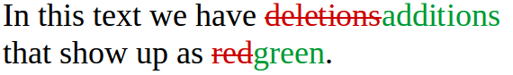
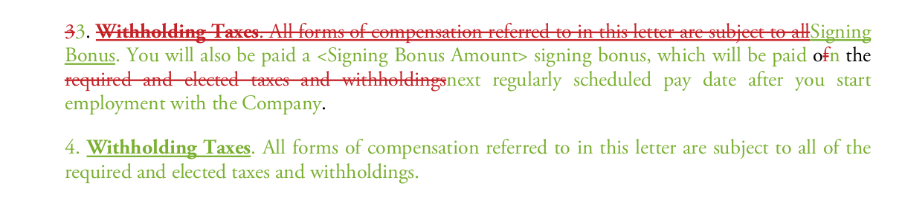
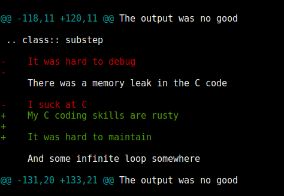
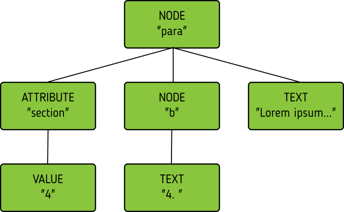
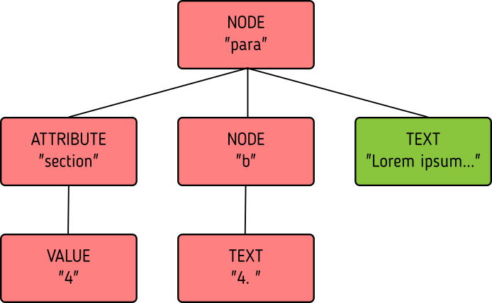

:skip-help: true
:css: css/stylesheet.css
:title: How to diff XML

.. footer::

    .. image:: images/shoobx.png

----

How to diff XML
===============

.. class:: name

    Lennart Regebro

.. class:: location

    Plone Conf 2018, Tokyo

----

.. class:: blurb

    Shoobx is the only comprehensive platform for incorporation, employee
    onboarding, equity management, fundraising, board & stockholder
    communication, and more.

.. note::

    I work for Shoobx.

    We do a lot of cool things that involve legal documents,
    and long story short, if you have a Delaware C-Corp, you need us.
    If you are gonna do a startup, you need us.
    Maybe you don't know it yet, but you do.

----

.. note::

    Although you can print your legal docs and sign them with a pen and then scan them into our system,
    one of our benefits is that you don't have to do that.

----

SBT + magic = PDF
=================

.. note::

    You can create the legal document in our system and sign everything electronically.
    There are workflows for doing all this and filling in documents,
    you can customize them and loads of things I only understand halfway because I'm not a lawyer.

    So we have loads of documents, many of them generated through our own template language,
    unsurprisingly called "SBT" for "Shoobox templates".
    (Psst, it's really mostly reportlab RML + ZPT and a bit of magic).

----

.. note::

    Both documents and templates can have revisions,
    and of course it would be nice to have a way of showing the differences.

----

.. class:: substep

    .. image:: images/docdiffnope.png

.. note::

    Obviously a text diff won't do,
    we need the sort of WYSIWYG difference where inserts are shown in green,
    and deletes are shown in red and with a strike through.

    It should be easy to read, and semantically meaningful. Ie, if you
    replace a word, it should show that in the diff, -> it shouldn't show
    that what characters in that word needs replacing. That's not readable.

    The first effort of making a diff for templates worked, but has less than
    optimal results. It was implemented by someone else than me, and I'm told
    it took a month or so. Clearly faster programmers than me at work.

----

xmldiff 0.6
===========

.. note::

    Diffing XML was trickier than we thought, and why not use somebodies
    library? So, we took over maintenance of the xmldiff library. It existed,
    seemed to work, but was unmaintained, which is why it wasn't used from
    the start.

    It isn't only a library, it's also a command line tool.

    I was tasked with implementing document diffing based on xmldiff.

----

.. note::

    That wasn't hard, but it *also* didn't give nice diffs.

    What you can see here is that instead of inserting a new paragraph three,
    and then changing the numbering, it modifies paragraph three, reinserts
    it as paraphraph 4. It's worse than this, because it then deletes
    paragraph 4 and reinserts it as paragraph five, and only then does
    it start to change the numbering, as it should do from the start.

----

The output was no good

.. class:: substep

    There was a memory leak in the C code

    My C coding skills are rusty

    It was hard to maintain

    And some infinite loop somewhere

    And it was really hard to improve the matching

.. note::

    So, the output was no good.
    But that wasn't the only problem with xmldiff.

    * -> There was a memory leak in the C code. -> I haven't done any major
      programming in C since the 90s, and this had it's central parts in C.

    * -> The Python code was very fond of one or two letter variable names, like
      typical C, so yeah, it was hard to read. The internal data structure was
      a hierarchical list of lists with the parent list contained in the child
      list, so just infinite loops of lists of lists.

    * -> And there was some infinite loop somewhere, maybe because of the data structure?

    * -> And it was really hard to improve the matching, for reasons I'll come to later.

----

xmldiff (again!)
================

.. class:: substep

    Almost entirely incompatible

    Pure-python

    Better results

    Easier to use as a library

    Supports writing formatters!

.. note::

    For these reasons I ended up scratching all of xmldiff, and writing a new
    library, which we after some discussion and deliberation decided to call
    <fanfare> xmldiff! This has been released as xmldiff version 2, current
    version is 2.2.

    ->Almost entirely incompatible

    ->Pure-python

    ->Better results

    ->Easier to use as a library

    ->Supports writing formatters! (I'll explain formatter later)

----

How do you diff?
================

Match
-----

Edit
----

Output
------

.. note::

    So, how DO you diff? Before we talk XML,
    let's look at a simpler diff case: Text files.

    There's three stages to diffing. Matching, edit, output.

----

Matching
========

.. note::

    In text files when you want to show a diff in a readable way, diffing is
    typically done line by line, so matching is easy: Are two lines exactly
    the same? Then they match.

    But how do you match? Just going line by line and comparing? No, you use
    an algorithm called Longest Common Subsequence.

----

Longest Common Subsequence
==========================

.. class:: substep

    Old: 1 2 3 4 5 6 7 8

    New: 1 2 9 4 6 5 7 7

    LCS: 1 2 4 6 7

.. note::

    Basically you look for bits that are the same and come in the same order.

    Compare the ->old list, with the ->new list, and we get an ->LCS list.
    The longest list of items where all items are in the same order in both
    files.

    For a text file, you run lcs on the lines. From this we get a list of
    lines that match.

----

MAKE AN IMAGE HERE

.. note::

    Longest Common Subsequence makes a grid of all items vs all items,
    and then walks through them to find the shortest path from one corner to the other corner.

    As you see, this grid gets quickly larger with increasing file sizes,
    and it's worse than that,
    because each cell also keeps track of the way you reach that cell,
    so that if you end up in the same cell twice you can see how you got there.
    It can use a lot of memory, typically time and memory is quadratic.

----

MAKE AN IMAGE HERE

.. note::

    But I read through all Python implementations of LCS I could find,
    and I found one using a common version that just keeps track of the paths,
    and doesn't generate the actual array, and doesn't keep the history per node.

    Another good trick is to compare the start and the end of the sequences,
    and skip anything that us equal there.

    The end result has 30 lines of actual code,
    so it's fairly compact and fast, but I'm sure it still can be improved.
    If you like that kind of challenge to make this faster or use less memory
    please dig your teeth into it.

----

Editing
=======

.. code::

    Delete 3
    Insert 9 at position 3
    Delete 5
    Insert 5 at position 6
    Delete 8
    Insert 7 at position 8

.. note::

    After matching comes editing.

    From the list of matching nodes we generate an edit script,
    which is a list of edit actions that turn file1 into file 2.
    The edit actions are basically "delete lines x-y", insert line at z, etc.

    Edit scripts should preferably be compact, so they can be used to store
    different versions in a change management system, without using up
    silly amounts of space. The output of course have no such requirement,
    it should instead be easy to read.

----

Output
======

.. note::

    And then we use that edit script to make a nice looking output output.

    Not so hard, is it? But if XML was this easy, I wouldn't have a talk.
    So, how to do it?

----

Matching XML
============

.. code:: xml
    :class: substep

    <para section="3">
        <b>3. </b>Lorem ipsum have some gypsum
    </para>

.. note::

    First of all, the matching. We don't match lines or texts, we match nodes.

    The node matching is tricky for XML. Scientific papers on
    hierarchical diffing generally view hierarchies as nodes that have a
    value, and children, and that's it.

    So, xmldiff 0.6 made something clever here, it converted one complex XML node
    to many simple nodes.

    -> For example, these two nodes, a para node and a b node, gets converted
    into six simple nodes.
    ->

    Now every node only has an type, a value, and children.
    Comparison is now easy!

----

A new version
=============

.. code:: xml

    <para section="4">
        <b>4. </b>Lorem ipsum have some gypsum
    </para>

.. note::

    But clever is always dangerous in computing...

    What happen if we insert another paragraph node before this node?
    Well, the number changes, which changes the value in two nodes.

    When xmldiff is to make a diff and compare these two nodes,
    it will first notice that the two nodes with numbers have changed,
    those values are different, so the nodes don't match any more.

    Their parent nodes; the section attribute and the b node, they now have no
    children in common with the old version of the tree.
    So they don't match.

----

No match!
=========

.. code:: xml

    <para section="4">
        <b>4. </b>Lorem ipsum have some gypsum
    </para>

.. note::

    Which means the top node has two out of three children that do not match,
    so it doesn't match.

    So to us, these nodes are obviously the same, just different numbering,
    but to xmldiff it was obviously NOT the same node, and the result is
    what we saw before.

----

:data-x: r-16000

.. note::

    Bad matchings

----

:data-x: r17200

Node:
=====

.. code:: xml

    <para section="3">
        <b>3. </b>Lorem ipsum have some gypsum
    </para>

Value:
======

.. code::

   "section:3 Lorem ipsum have some gypsum"

.. note::

    You need to look at a node  as a whole, not as independent pieces.

    I make a string out of the nodes attributes and it's texts, and then use
    the standard library's ``difflib`` to get a similarity ratio out of that.
    And that actually uses the Longest Common Subsequence method I mentioned
    before. If the node has children, I also take that into account in equal
    measure to the difflibs ratio.

    This works, but there is a lot of room for alternatives here. I've f ex
    tried dealing with attributes separately from texts, so that there could
    be different weights for text, children and attributes. But I haven't
    been able to significantly improve what I have right now, which I arrived
    at more or less by trial and error.

----

:data-x: r1200

Matching procedure: LCS?
========================

.. class:: substep

    Fast, bad matching

.. note::

    Longest common subsequence can be used in theory. You can flatten both trees
    with a traversal, and then use LCS on that, -> but it leaves a lot of nodes
    unmatched that could be matched. It also means you don't always find the
    best match, only a good enough match, wich is far from optimal.

    The diffs get very big, not at all compact as we want them

----

Compare all nodes to all nodes
==============================

.. class:: substep

    Nightmarishly slow

.. note::

    Finding the best possible match over two big sets is often called the
    stable marriage problem. And there are algorithms for this, but since
    you need to check what the best possible match is for all nodes,
    you really need to compare every node to every node. ->

    That would have been crazy slow.

----

Single-iteration best match
===========================

.. class:: substep

    Good enough!

.. note::

    What I did early on was simply to go through each node from one tree and
    find the best match for that node, and then remove both nodes from the
    lists of unmatched nodes. That means that the best match from the
    perspective of one tree always wins, but that's not always the best match
    from the perspective of the other tree. But this gives a decent match for
    our use case.

    It was also the recommended way in the main paper that we used on how to
    do hierarchical diffing.

    This could take almost two minutesfor some of our documents, so I hope
    you forgive me for not even trying the previous stable marriage
    algorithms, which are even slower.

----

XML edit actions
================

.. class:: substep

    DeleteNode, InsertNode, RenameNode, MoveNode

    DeleteAttrib, InsertAttrib, RenameAttrib, UpdateAttrib

    UpdateTextIn, UpdateTextAfter

    InsertComment

.. note::

    Where a linear file can get away with just two actions, insert and
    delete, and if they want to be fancy, a move action, xml needs more.

    -> We can rename nodes as well, so we get four actions,
    -> And we can delete, insert rename and update attributes.
    -> And, you can update texts, both inside and after a node.
    -> And you need a separate action to insert comments, as they aren't real
    nodes.

    So, eleven different actions. And notice we don't support moving
    attributes or texts, in theory we could have that as well, but detecting
    moves of attributes and nodes would take quite some extra processing
    power to detect, so we skip that.

----

Making the edit script
======================

.. class:: substep

    Walk the "new" tree, node by node.

    If it has a match, look for differences.

    If there is no match, insert it!

    Delete all nodes from the old tree with no match.

.. note::

    Now we have a list of node matchings.
    Then we go over the tree again, node by node.

    -> If that node has a match, we must look at what the differences are. In
    the plain text case we can match on equality, but for complex nodes like
    XML we can't, because like with the renumbering case we would get a lot
    of misses when we should have had matches.

    -> If it does not have a match, insert it!

    -> Lastly delete all nodes from the "old" tree without a match.

----

Generate output
===============

.. code::

    [update-attribute, /para[1], section, "4"]
    [update-text, /para/b[1], "4. "]

.. note::

    We can of course just print out the edit script. But as I mentioned, we
    want that nice GUI diff. How do you do THAT?

    What we want is an XML output that we still can render to a document,
    but which includes diff information. We want this:

----

End Result
==========

.. code:: xml

    <para section="4" class="modified">
        <b>3
           4. </b>
        Lorem ipsum have some gypsum
    </para>

.. note::

    So how can we get there? Xmldiff 2 includes formatters for different
    outputs, including one just called "XML" that will give this sort of
    output:

----

XML Output
==========

.. code:: xml

    <para section="4" diff:update-attr="section:3">
        <b><diff:delete>3</diff:delete>
           <diff:insert>4</diff:insert>. </b>
        Lorem ipsum have some gypsum
    </para>

.. note::

    The translation of these tags to span tags or class attributes is fairly
    straightforward with XSLT, although it of course depends on your XML
    format. If it's very complex, then the XSLT can get very complex as well.

----

XSLT gotcha
===========

.. code:: xml

  <app:term name="expenses" set="advisor"
      allowCustom="True">
    <app:option name="bear_own">
      <whatever/>
    </app:option>

    <app:option name="reimburse">
      <blahblah/>
    </app:option>
  </app:term>

.. note::

    We have XML that looks like this. It's basically a sort of app-specific
    switch statement.

    And we have XSLT that deals with this.

----

.. code:: xml

      <xsl:value-of
          select="sbx:getFieldTitle($content-expr)" />

.. note::

    And one part of that XSLT is this. Yes, in XSLT you can call functions,
    and with lxml, which we are using, those can be python functions.

    That function gets the title of the field from the app:term, and sets it
    on the app:option.

    But, if app:option is not a child of an app:term, that function breaks!
    Now how can that happen after diffing? Well, it's a node mismatch again.
    In one version a section of the document might be inside one of these
    app:term/app:option tags, and later version, that section is inside some
    other sort of tag.

    And this can lead to a mismatch. Some nodes attributes and content is
    very similar to the app:term, so we get a match! But only for one of the
    options. The other options get deleted.

----

.. code:: xml

  <asection name="expenses" allowCustom="True"
      diff:rename="app:term" diff:delete-attr="set">
    <whatever diff:delete="" diff:insert="" />
    <app:option name="bear_own" diff:delete="">
    </app:option>

    <blahblah diff:delete="" diff:insert="" />
    <app:option name="reimburse" diff:delete="">
    </app:option>
  </app:term>

.. note::

    The end result is XML that looks somewhat like this. Note now that the
    app:option tags now are deleted, but more importantly, the app:term has
    been renamed and one of the attributes have been deleted.
    This breaks the Python function that is being called!

    So you have to either fix the function so it doesn't break in this case,
    or modify the XSLT so that it isn't called for deleted nodes.

    But most likely you don't do this advanced stuff, so you might think
    "Oooh, I'm gonna diff my HTML docs with xmldiff!" and then we come to the
    next problem!

----

Matching text
=============

.. note::

    Another problem we get here is how to match text. If we just use LCS on
    the text, we'll get very hard to read diffs.

    So we need some sort of semantic diffing there.
    And we decided to use Googles diff_match_patch_library modules.

----

Formatted text
==============

Old:
----

.. code::

    
This is formatted text

New:
----

.. code::

    
This <b>is</b> formatted <i>text</i>

.. note::

    Formatted text has it's own little issues.

    For example, if you simply add a bit of formatting to some text, you have
    very big effects.

    The text of the P-node has changed from "This is text that can have
    formatting" to "This". The node also have two new children.

    The old P node and the new P node will not match. Oy vey, what to do?

----

Unicode stubs
=============

``
This \ue000is\ue001 text that can have \ue002formatting\ue003
``

.. note::

    We replace tags with unicode characters before the diffing.
    This means the nodes will match, but since the contained text isn't the
    same we get an edit script action to update that text.

    The formatter that outputs the XML knows that these unicode characters
    are replacements, and will insert the correct tags.

    And the characters used are from the Private User are in Unicode, don't
    worry.

----

Unicode stubs
=============

.. code::

    
This <b diff:insert="">text</b> that can have
    <i diff:insert="">formatting</i>

.. note::

    And we get a good result!

----

Soooo slooow
============

.. class:: substep

    Stop looking when you find perfection

    Use faster algorithms from ``difflib``

    Implement the LCS "fast-match" algorithm

    Caching

.. note::

    As I mentioned before, xmldiff 2.0 was very slow. The worst diff case we
    had took more than one and a half minute. So I went on to trying to
    improve that, making the matching faster etc.

    One of the biggest speedups was implementing a shortcut. -> If any match
    was 100%, then we'd stop looking for better matchings. -> I also added a
    flag to choose between three different ways of calculating how different
    two nodes are, "accurate" (the one used in 2.0), "fast" (good enough) and
    "faster" which is only so-so.

    -> And I added a fast-match option, which uses LCS as a first step to find
    matches quick, and then do the slower algorithms on the unmatched nodes. -> Also a bit of caching.

----

Harder, Better, Faster, Stronger
================================

.. class:: substep

    xmldiff 0.6: 8 seconds

    xmldiff 2.0: 100 seconds

    xmldiff 2.1: 5 seconds

    With faster ratio-mode: 2 seconds

    With fast-match: 1.5 seconds

.. note::

    By the end, I had gotten the time down for a typical XML document to 20%
    of the time. In our worst case example, -> xmldiff 0.6 took 8 seconds.
    -> xmldiff 2.0 took a 100. -> But I got that down to 5.1, and with
    less accurate matching, down to 3, and with the LCS fast-match algorithm
    to 1.5 seconds.

    So yes, we get better matching AND faster diffing, even in pure python.

----

How can YOU use it?
===================

.. code::

    >>> from xmldiff import main
    >>> main.diff_files(
    ...     "../tests/test_data/insert-node.left.html",
    ...     "../tests/test_data/insert-node.right.html")
    [UpdateTextIn(node='/body/div[1]', text=None),
     InsertNode(target='/body/div[1]', tag='p', position=0),
     UpdateTextIn(node='/body/div/p[1]', text='Simple text')]

.. note::

    You can of course use it from the command line, but that's not
    so exciting. What you really want to know is how to use it from Python,
    amiright?

    Well, it has a very simple API, here is one example, to diff two files.
    The result you get in that case is an edit script.

----

XML Output
==========

.. code::

    >>> from xmldiff import formatting
    >>> formatter = formatting.XMLFormatter(
    ...     text_tags=['p'], formatting_tags=['i', 'b'])
    >>> main.diff_files(
    ...     "../tests/test_data/insert-node.left.html",
    ...     "../tests/test_data/insert-node.right.html",
    ...                       formatter=formatter)
    <body xmlns:diff="http://namespaces.shoobx.com/diff">
      

        
Simple text

      

    </body>

.. note::

    Or you can specify the XMLFormmater to get XML output.
    The text_tags argument are a list of tags that contain formatted text,
    which enables the unicode substitution I mentioned before.
    A list of formatting_tags is there to enable the feature that reformmated
    text isn't shown as deleted with one format and inserted with another,
    but the text is instead shown in a way that makes clear that only the
    formatting has changed. How that is is up to you, but maybe with a yellow
    background?

----

Future
======

We ain't stopping now!

.. note::

    We're trying to fix bugs quickly, and so far it's been pretty good.
    We have some requests for more options when matching, for more control
    for your specific use case, but not much information to go on there,
    it seems mostly like theoretical questions from potential users.

    But yeah, we'd like more flexibility when matching, and it would be nice
    to have a stable marriage algorithm, maybe it won't get terribly slow.

----

Questions?
==========

https://github.com/Shoobx/xmldiff

https://readthedocs.org/projects/xmldiff/
